# Azure Product Growth Intelligence Platform

A production-style local reference implementation for product analytics, growth intelligence, governed ML, deterministic product insights, Power BI-ready reporting, and Azure-mappable analytical architecture. The project is intentionally local-first: default demonstrations and quality checks do not require a live Azure subscription, paid cloud resources, Power BI files, or customer data.

## Executive Summary

This repository shows how a product team could move from synthetic product events through governed ingestion, data quality, funnel analytics, retention, churn prediction, segmentation, recommendations, experimentation, evidence-grounded insights, and semantic reporting. It is designed for portfolio review, technical interviews, and architecture discussion.

It is not a deployed production system. It is a complete local reference implementation with deployment-ready design documentation.

## Business Problem

Modern product teams need a reliable way to understand how users discover, activate, engage, retain, churn, return, and respond to product changes. This repository will evolve into a reproducible platform that connects behavioural data, experimentation, machine learning, customer feedback, and GenAI-assisted insight generation into one governed analytical workflow.

The platform is designed to answer product questions such as:

- Who is using the product?
- Which behaviours and features drive engagement?
- Where do users abandon key journeys?
- Which users are at risk of churn?
- Which experiments cause statistically and practically meaningful improvements?
- Which items or features should be recommended?
- What themes and pain points appear in customer feedback?
- What actions should product teams prioritise?

## Intended Users

The repository is written for product data scientists, product analysts, growth analysts, analytics engineers, data engineers, ML engineers, AI engineers, product leaders, recruiters, and technical reviewers evaluating applied product analytics work.

## Platform Capabilities

Planned capabilities include synthetic product event generation, clickstream ingestion, validation, funnel analytics, cohort retention, churn prediction, segmentation, recommendation modelling, controlled A/B testing, customer feedback intelligence, GenAI-assisted product insights, Power BI-ready outputs, and Azure-aligned security, governance, monitoring, and deployment patterns.

Milestones 1-12 implement the repository foundation, deterministic synthetic NexaFlow data generation, local event ingestion with data-quality validation, governed funnel analytics, governed retention/cohort analytics, leakage-aware churn prediction, governed user segmentation, governed recommendation baselines, governed experiment analysis, deterministic local product insight generation, Power BI-ready reporting outputs, and final Azure architecture and portfolio documentation.

## Azure Service Mapping

| Platform concern | Azure target service | Current status |
| --- | --- | --- |
| Product event ingestion | Azure Event Hubs | Local batch ingestion and JSONL stream simulation implemented |
| Raw, trusted, and quarantine storage | Azure Data Lake Storage Gen2 | Local raw, interim accepted, and quarantine zones implemented |
| Stream processing | Azure Stream Analytics or Azure Functions | Local deterministic micro-batch simulation implemented |
| Analytical serving | Azure Synapse Analytics | Local governed funnel outputs implemented |
| Experiment analysis | Azure Machine Learning or governed Python workloads | Local fixed-window experiment analysis implemented |
| Model training and tracking | Azure Machine Learning | Local deterministic churn and recommendation baseline training implemented |
| User segmentation | Azure Machine Learning | Local governed rule-based and KMeans segmentation implemented |
| Recommendation batch generation | Azure Machine Learning | Local governed recommendation outputs implemented |
| GenAI insights | Azure AI Foundry and Azure OpenAI | Local deterministic product insight assistant implemented; Azure OpenAI is mapping only |
| Dashboards | Power BI | Power BI-ready local reporting tables and semantic specs implemented; no `.pbix` or deployment |
| Observability | Azure Monitor and Application Insights | Planned configuration placeholders |
| Governance | Microsoft Purview | Planned |
| Secret management | Azure Key Vault | Planned environment references |
| Identity and access | Microsoft Entra ID and Azure RBAC | Planned governance guidance |

## High-Level Architecture

```mermaid
flowchart LR
    A[Synthetic product sources] --> B[Event and batch ingestion]
    B --> C[Raw data layer]
    C --> D[Validation and quarantine]
    D --> E[Curated behavioural data]
    E --> F[Product analytics and feature engineering]
    F --> G[ML and experimentation]
    G --> H[GenAI insight generation]
    H --> I[Power BI-ready serving outputs]
    I --> J[Monitoring and governance]
```



## Synthetic NexaFlow Data

NexaFlow is a fictional collaborative productivity platform for individual professionals and small business teams. The Milestone 2 generator creates deterministic synthetic users, sessions, clickstream events, feature usage, subscriptions, experiment assignments, and customer feedback. Dataset contracts are documented in [docs/architecture/data-contracts.md](docs/architecture/data-contracts.md), and the data model is described in [docs/architecture/synthetic-data-model.md](docs/architecture/synthetic-data-model.md).

The committed sample fixture lives in `data/samples/nexaflow`. Larger local runs should be written under `data/raw/<run_id>/` and are ignored by Git.

## Ingestion and Data Quality

Milestone 3 adds a local ingestion pipeline that treats generated data as untrusted source input. The batch path discovers the seven required datasets, validates the source manifest and checksums, parses CSV and JSONL safely, applies executable contracts, detects schema drift, validates record-level and cross-dataset quality rules, handles duplicates, writes accepted and quarantined JSONL records, and emits quality, lineage, metrics, and ingestion manifest artefacts.

The streaming path simulates clickstream ingestion from `clickstream_events.jsonl` in deterministic micro-batches. It validates events one by one, attaches ingestion metadata, writes accepted and rejected event outputs, and records stream metrics without connecting to Azure Event Hubs.

Runtime ingestion outputs are written under `data/interim/<ingestion_run_id>/` and `outputs/quality/<ingestion_run_id>/`, which are ignored by Git. Concise reproducible evidence for the committed sample is stored in `docs/evidence/milestone-3/`.

## Governed Funnel Analytics

Milestone 4 adds deterministic funnel analytics over trusted Milestone 3 accepted outputs. The analytics layer verifies a passed ingestion manifest, loads accepted JSONL datasets, applies versioned funnel definitions, reconstructs one first-entry attempt per user per funnel, classifies attempts as completed, abandoned, incomplete, or censored, and writes governed summary, stage, segment, timing, drop-off, diagnostics, lineage, and manifest outputs.

Implemented funnels cover account activation, onboarding, collaboration adoption, trial-to-paid, automation adoption, and recommendation interaction. Segment outputs are descriptive and suppression-aware. Experiment variants may be used only as descriptive slices; this milestone does not calculate statistical significance, uplift, experiment winners, retention, churn, recommendations, GenAI insights, Power BI files, or Azure infrastructure.

Runtime funnel outputs are written under `outputs/analytics/funnels/<analysis_run_id>/`, which is ignored by Git. Concise reproducible evidence for the committed sample is stored in `docs/evidence/milestone-4/`.

## Retention and Cohort Analytics

Milestone 5 adds deterministic retention analytics over trusted Milestone 3 accepted outputs. It defines signup, activation, paid-user, collaboration-user, automation-user, and recommendation-engaged retention cohorts. The default portfolio evidence uses weekly periods with Monday-start ISO weeks, while daily and calendar-month grains are also supported.

The retention layer uses governed qualifying activity that excludes passive or error-only events such as isolated `session_started`, `feature_error`, `request_failed`, and passive recommendation exposure. Outputs distinguish classic period retention, rolling retention, return rates, active-user rates, right-censored periods, descriptive lifecycle statuses, and resurrection patterns.

Runtime retention outputs are written under `outputs/analytics/retention/<analysis_run_id>/`, which is ignored by Git. Concise reproducible evidence for the committed sample is stored in `docs/evidence/milestone-5/`. Lifecycle status is descriptive only and is not a churn prediction label.

## Churn Prediction

Milestone 6 adds deterministic churn prediction over trusted Milestone 3 accepted outputs. The target is `behavioural_churn`: no qualifying product activity in the future label window after a point-in-time snapshot. Defaults use a 28-day feature lookback and 28-day prediction horizon, with one eligible snapshot per user.

The workflow prevents leakage by excluding post-snapshot events, future subscriptions, future funnel completion, and label-window activity from features. Feature groups cover account context, activity volume, engagement trajectory, activation and funnel context, feature adoption, friction and reliability, subscription state at snapshot, and historical inactivity. Chronological train, validation, and test splits are used; validation metrics select between a prevalence baseline, class-weighted logistic regression, and random forest comparison.

Runtime churn outputs are written under `outputs/models/churn/<model_run_id>/`, which is ignored by Git. Concise reproducible evidence for the committed sample is stored in `docs/evidence/milestone-6/`, including model definition, feature catalogue, splits, metrics, threshold analysis, model card, diagnostics, manifest, lineage, and executive report. The model is a synthetic-data demonstration only and must not be used for automated adverse decisions.

## Governed User Segmentation

Milestone 7 adds deterministic user segmentation over trusted Milestone 3 accepted outputs. The segmentation workflow creates one latest valid point-in-time snapshot per eligible user, computes historical lookback features, assigns mutually exclusive rule-based segments, evaluates deterministic KMeans cluster candidates, selects a cluster count with quality and stability safeguards, names clusters from profile traits, and emits PCA coordinates for analytical visualisation.

Feature groups cover account context, activity level, engagement depth, collaboration, automation and advanced features, monetisation, recommendation engagement, reliability and friction, journey context, and retention-style historical behaviour. Identifiers are excluded from clustering inputs. Segment names are deterministic analytical interpretations and are not causal claims.

Runtime segmentation outputs are written under `outputs/models/segmentation/<segmentation_run_id>/`, which is ignored by Git. Concise reproducible evidence for the committed sample is stored in `docs/evidence/milestone-7/`.

## Governed Recommendation Baseline

Milestone 8 adds deterministic recommendation baselines over trusted Milestone 3 accepted outputs. The workflow creates a governed product-action catalogue, maps clickstream events into implicit-feedback strengths, builds point-in-time user-item interactions, applies plan/persona/company-size eligibility, generates candidates, compares popularity, recent-popularity, segment-aware popularity, and item-item collaborative-filtering baselines, and reports offline ranking, coverage, novelty, diversity, segment, and cold-start metrics.

Runtime recommendation outputs are written under `outputs/models/recommendations/<recommendation_run_id>/`, which is ignored by Git. Concise reproducible evidence for the committed sample is stored in `docs/evidence/milestone-8/`. The workflow is an offline synthetic-data baseline only; it is not an online recommender, causal treatment policy, or experiment readout.

## Governed Experiment Analysis

Milestone 9 adds deterministic fixed-window A/B experiment analysis over trusted Milestone 3 accepted outputs and experiment assignments. The workflow defines a governed experiment catalogue, validates assignment integrity, derives exposure, keeps intention-to-treat as the primary population, reports exposed analysis separately, calculates binary, continuous and count treatment effects, estimates confidence intervals and p-values, checks sample-ratio mismatch, applies multiple-testing correction, evaluates power and sample sufficiency, analyses guardrails, suppresses underpowered segment slices, and applies deterministic decision rules.

Runtime experiment outputs are written under `outputs/experiments/<analysis_run_id>/`, which is ignored by Git. Concise reproducible evidence for the committed sample is stored in `docs/evidence/milestone-9/`. The workflow is offline synthetic-data analysis only; it is not online experimentation infrastructure, uplift modelling, adaptive assignment, GenAI, Power BI, or Azure deployment.

## GenAI Product Insight Assistant

Milestone 10 adds a governed product insight assistant that converts committed Milestone 4-9 evidence into structured, auditable insights and deterministic reports. The default `deterministic_template` provider runs fully offline, builds a prompt package, generates grounded insights with local citations, enforces governance checks, and writes product health, executive insight, action brief, risk register, lineage, manifest, and assistant card artifacts.

An `azure_openai_placeholder` provider records future Azure AI Foundry / Azure OpenAI adapter metadata but performs no live call. The milestone does not implement live chat, vector search, deployed agents, Power BI files, Azure SDK clients, Azure OpenAI calls, or automated product decisions.

Runtime insight outputs are written under `outputs/genai/product-insights/<assistant_run_id>/`, which is ignored by Git. Concise reproducible evidence for the committed sample is stored in `docs/evidence/milestone-10/`.

## Power BI-Ready Reporting Layer

Milestone 11 adds deterministic reporting outputs over committed Milestone 4-10 evidence. It writes compact fact and dimension CSVs, semantic-model JSON and Markdown, a metric dictionary, dashboard page specs, visual specs, refresh guidance, governance notes, diagnostics, lineage, and manifest checksums.

Runtime reporting outputs are written under `outputs/reporting/powerbi/<run_id>/`, which is ignored by Git. Concise reproducible evidence for the committed sample is stored in `docs/evidence/milestone-11/`. The milestone does not create `.pbix` files, connect to Power BI Service, deploy Fabric workspaces, or provision Azure resources.

## Analytics, ML, and GenAI Use Cases

Analytics use cases include active user tracking, journey funnels, feature adoption, retention, churn, resurrection, customer lifetime value, governed user segmentation, and fixed-window experiment analysis. ML use cases now include local churn prediction, segmentation, and recommendation baseline demonstrations; uplift modelling remains out of scope. GenAI-style use cases now include deterministic grounded product insight reports; live LLM integration remains a future Azure mapping, not a local dependency.

## Repository Structure

```text
.
├── .github/workflows/          # CI quality workflow
├── configs/                    # Safe local and Azure example configuration
├── data/                       # Empty retained local data zones
├── dashboard/                  # Future Power BI/dashboard artifacts
├── diagrams/                   # Future architecture visuals
├── docs/                       # Architecture, ADRs, governance, runbooks
├── infrastructure/             # Future Bicep and Terraform options
├── outputs/                    # Local generated outputs, ignored by Git
├── reports/                    # Local generated reports, ignored by Git
├── scripts/                    # Future operational scripts
├── src/product_growth_intelligence/
│   ├── analytics/
│   ├── data_generation/
│   ├── experiments/
│   ├── features/
│   ├── genai/
│   ├── ingestion/
│   ├── models/
│   ├── monitoring/
│   ├── recommendations/
│   ├── reporting/
│   └── validation/
└── tests/
    ├── integration/
    └── unit/
```

## Milestone Roadmap

Milestone 1 — completed  
Milestone 2 — completed  
Milestone 3 — completed  
Milestone 4 — completed  
Milestone 5 — completed  
Milestone 6 — completed  
Milestone 7 — completed  
Milestone 8 — completed  
Milestone 9 — completed  
Milestone 10 — completed  
Milestone 11 — completed  
Milestone 12 — completed

| Milestone | Business objective | Main engineering outputs | Testing expectations | Evidence/reporting outputs |
| --- | --- | --- | --- | --- |
| 1. Repository foundation and architecture | Establish a credible, reproducible base | Package, configs, docs, CI, governance | Lint, type checks, unit tests | Completed |
| 2. Synthetic product data | Create realistic non-customer data | Deterministic generators and schemas | Generator and schema tests | Completed |
| 3. Event ingestion and validation | Move events into governed zones | Batch/local ingestion and validation | Contract and quarantine tests | Completed |
| 4. Funnel analytics | Explain journey conversion | Funnel metric modules | Metric unit tests | Completed |
| 5. Retention and cohort analysis | Measure product stickiness | Cohort tables and retention views | Windowing tests | Completed |
| 6. Churn prediction | Identify at-risk users | Leakage-aware features and model training | Reproducibility and evaluation tests | Completed |
| 7. User segmentation | Explain behavioural groups | Rule-based and KMeans segmentation | Determinism and profile tests | Completed |
| 8. Recommendation baseline | Suggest items or features | Baseline recommender | Ranking tests | Completed |
| 9. A/B testing analysis | Evaluate product changes | Experiment analysis module | Statistical tests | Completed |
| 10. GenAI product insight assistant | Summarise grounded insights | Prompting and grounding layer | Mocked GenAI tests | Completed |
| 11. Power BI-ready outputs | Serve decision-ready datasets | Export tables and semantic docs | Schema tests | Completed |
| 12. Azure architecture, deployment options and portfolio polish | Show cloud deployment path | Final docs, diagrams, evidence, infrastructure skeletons | Static validation | Completed |

## Local Setup

```bash
python -m venv .venv
source .venv/bin/activate
make install
make quality
pgi project-info
make generate-sample
```

Useful commands:

```bash
make format
make lint
make type-check
make test
make quality
make generate-sample
make ingest-sample
make verify-ingestion-evidence
make analyse-funnels-sample
make verify-funnel-evidence
make analyse-retention-sample
make verify-retention-evidence
make train-churn-sample
make verify-churn-evidence
make segment-users-sample
make verify-segmentation-evidence
make build-recommendations-sample
make verify-recommendation-evidence
make analyse-experiments-sample
make verify-experiment-evidence
make generate-product-insights-sample
make verify-product-insight-evidence
make build-reporting-layer-sample
make verify-reporting-evidence
make generate-final-evidence
make verify-final-evidence
make verify-portfolio
```

Generate a synthetic run directly:

```bash
python3 -m product_growth_intelligence generate-data \
  --profile sample \
  --output-dir data/raw/sample-run
```

Run batch ingestion against the committed sample:

```bash
python3 -m product_growth_intelligence ingest-batch \
  --source data/samples/nexaflow \
  --output-root data/interim \
  --quality-root outputs/quality \
  --fixed-ingestion-time 2026-01-01T00:00:00Z
```

Run the clickstream stream simulation:

```bash
python3 -m product_growth_intelligence ingest-stream \
  --source data/samples/nexaflow/clickstream_events.jsonl \
  --output-root data/interim \
  --quality-root outputs/quality \
  --micro-batch-size 25 \
  --fixed-ingestion-time 2026-01-01T00:00:00Z
```

Run funnel analytics against trusted ingestion output:

```bash
python3 -m product_growth_intelligence analyse-funnels \
  --input-dir data/interim/<ingestion_run_id> \
  --output-root outputs/analytics/funnels \
  --fixed-analysis-time 2026-01-02T00:00:00Z
```

Run retention analytics against trusted ingestion output:

```bash
python3 -m product_growth_intelligence analyse-retention \
  --input-dir data/interim/<ingestion_run_id> \
  --output-root outputs/analytics/retention \
  --time-grain weekly \
  --fixed-analysis-time 2026-01-02T00:00:00Z
```

Train the churn model against trusted ingestion output:

```bash
python3 -m product_growth_intelligence train-churn-model \
  --input-dir data/interim/<ingestion_run_id> \
  --output-root outputs/models/churn \
  --lookback-days 28 \
  --label-window-days 28 \
  --fixed-run-time 2026-01-02T00:00:00Z
```

Run governed user segmentation against trusted ingestion output:

```bash
python3 -m product_growth_intelligence segment-users \
  --input-dir data/interim/<ingestion_run_id> \
  --output-root outputs/models/segmentation \
  --snapshot-time 2025-06-30T23:59:59Z \
  --lookback-days 56 \
  --fixed-run-time 2026-01-02T00:00:00Z
```

Run governed recommendations against trusted ingestion output:

```bash
python3 -m product_growth_intelligence build-recommendations \
  --input-dir data/interim/<ingestion_run_id> \
  --output-root outputs/models/recommendations \
  --snapshot-time 2025-03-31T23:59:59Z \
  --lookback-days 56 \
  --holdout-days 28 \
  --fixed-run-time 2026-01-02T00:00:00Z
```

Run governed experiment analysis against trusted ingestion output:

```bash
python3 -m product_growth_intelligence analyse-experiments \
  --input-dir data/interim/<ingestion_run_id> \
  --output-root outputs/experiments \
  --analysis-time 2025-06-30T23:59:59Z \
  --fixed-run-time 2026-01-02T00:00:00Z
```

Generate deterministic product insights from committed evidence:

```bash
python3 -m product_growth_intelligence generate-product-insights \
  --evidence-root docs/evidence \
  --output-root outputs/genai/product-insights \
  --provider deterministic_template \
  --fixed-run-time 2026-01-02T00:00:00Z
```

Build Power BI-ready reporting outputs from committed evidence:

```bash
python3 -m product_growth_intelligence build-reporting-layer \
  --evidence-root docs/evidence \
  --output-root outputs/reporting/powerbi \
  --fixed-run-time 2026-01-02T00:00:00Z
```

Generate final portfolio evidence:

```bash
make generate-final-evidence
make verify-final-evidence
```

## Evidence Index

The deterministic evidence index is documented in [docs/evidence/README.md](docs/evidence/README.md). It covers Milestone 3 ingestion through Milestone 12 final architecture and portfolio readiness evidence.

## How to Review the Project

Recommended review path:

1. Read this README for the executive overview and local commands.
2. Review [docs/architecture/final-azure-reference-architecture.md](docs/architecture/final-azure-reference-architecture.md).
3. Review [docs/architecture/local-to-azure-mapping.md](docs/architecture/local-to-azure-mapping.md).
4. Review [docs/portfolio/technical-review-guide.md](docs/portfolio/technical-review-guide.md).
5. Inspect [docs/evidence/README.md](docs/evidence/README.md) and the milestone evidence folders.
6. Run `make quality` and `make verify-final-evidence`.

## Interview Positioning

This project can be discussed as:

- a product analytics and growth intelligence platform;
- an analytics engineering system with contracts, lineage, and reproducibility;
- a governed ML demonstration for churn, segmentation, and recommendations;
- an experimentation and decision-quality workflow;
- a deterministic GenAI/product insight assistant;
- a Power BI-ready semantic reporting handoff;
- an Azure-mappable architecture that is deliberately not live-deployed.

## What Is Not Deployed

The repository does not provision Azure resources, create service principals, store secrets, run Azure deployment commands, call Power BI Service, create `.pbix` files, call Azure OpenAI by default, or configure paid cloud automation.

## Quality and Security Principles

The implementation favours typed Python, deterministic behaviour, small interfaces, no embedded secrets, no generated data in Git, clear metric ownership, local validation by default, and Azure-specific adapters only where they are useful. Future Azure deployments should use managed identity, RBAC, Key Vault, private networking where appropriate, and monitoring that avoids leaking customer data.

## Current Implementation Status

| Area | Status | Notes |
| --- | --- | --- |
| Repository structure | Completed | Empty future directories retained with `.gitkeep` |
| Python package and CLI | Completed | `pgi project-info` confirms install metadata |
| Config foundation | Completed | Safe placeholders only |
| Architecture documentation | Completed | Logical flow, service mapping, contracts, metrics |
| Governance documentation | Completed | Initial policies and responsible analytics guidance |
| Synthetic datasets | Completed | NexaFlow sample fixture and generator implemented |
| Event ingestion and data quality | Completed | Batch ingestion, stream simulation, contracts, quarantine, reports, lineage |
| Governed funnel analytics | Completed | Versioned funnels, first-entry attempts, stage metrics, diagnostics, evidence |
| Retention and cohort analytics | Completed | Versioned retention definitions, cohort periods, censoring, lifecycle, evidence |
| Churn prediction | Completed | Local deterministic model training, evaluation, model card, evidence |
| User segmentation | Completed | Rule-based segments, KMeans, stability, PCA, profiles, evidence |
| Recommendation baseline | Completed | Local deterministic candidate generation, ranking, metrics, reasons, evidence |
| Experiment analysis | Completed | Local assignment integrity, SRM, treatment effects, guardrails, decisions, evidence |
| GenAI product insights | Completed | Local deterministic evidence-grounded assistant, reports, governance checks, evidence |
| Power BI-ready reporting | Completed | Local reporting tables, semantic specs, dashboard specs, evidence |
| Azure architecture and portfolio polish | Completed | Final docs, diagrams, evidence index, deployment options |
| Azure deployment | Not deployed | No live resources required or provisioned |

## Synthetic-Data Disclaimer

This repository is designed around synthetic data only. It must not be used to store real customer data, secrets, production exports, proprietary telemetry, or regulated personal information unless future governance controls are explicitly implemented and reviewed.

## Portfolio Positioning

This project is intended to demonstrate practical product analytics engineering, Azure-aligned system design, responsible ML and GenAI thinking, semantic reporting, and clean repository craftsmanship. It is a production-style local reference implementation, not a deployed production system.

## Final Limitations

Synthetic data enables reproducible review but does not replace production data governance, privacy review, access control, scale testing, model-risk validation, cost management, incident response, or operational ownership. Live Azure deployment would require a separate implementation and approval process.
