# Azure Product Growth Intelligence Platform

A production-style reference implementation for product analytics, growth intelligence, and Azure-mappable analytical systems. The project is intentionally local-first: default demonstrations and quality checks do not require a live Azure subscription, paid cloud resources, or customer data.

## Business Problem

Modern product teams need a reliable way to understand how users discover, activate, engage, retain, churn, return, and respond to product changes. This repository will evolve into a reproducible platform that connects behavioural data, experimentation, machine learning, customer feedback, and GenAI-assisted insight generation into one governed analytical workflow.

The platform is designed to answer product questions such as:

- Who is using the product?
- Which behaviours and features drive engagement?
- Where do users abandon key journeys?
- Which users are at risk of churn?
- Which experiments cause statistically and practically meaningful improvements?
- Which items or features should be recommended?
- What themes and pain points appear in customer feedback?
- What actions should product teams prioritise?

## Intended Users

The repository is written for product data scientists, product analysts, growth analysts, analytics engineers, data engineers, ML engineers, AI engineers, product leaders, recruiters, and technical reviewers evaluating applied product analytics work.

## Platform Capabilities

Planned capabilities include synthetic product event generation, clickstream ingestion, validation, funnel analytics, cohort retention, churn prediction, segmentation, recommendation modelling, controlled A/B testing, customer feedback intelligence, GenAI-assisted product insights, Power BI-ready outputs, and Azure-aligned security, governance, monitoring, and deployment patterns.

Milestones 1, 2, 3, 4, and 5 implement the repository foundation, deterministic synthetic NexaFlow data generation, local event ingestion with data-quality validation, governed funnel analytics, and governed retention/cohort analytics. Later ML, recommendation, experimentation, GenAI, dashboard, and Azure deployment work remains planned.

## Azure Service Mapping

| Platform concern | Azure target service | Current status |
| --- | --- | --- |
| Product event ingestion | Azure Event Hubs | Local batch ingestion and JSONL stream simulation implemented |
| Raw, trusted, and quarantine storage | Azure Data Lake Storage Gen2 | Local raw, interim accepted, and quarantine zones implemented |
| Stream processing | Azure Stream Analytics or Azure Functions | Local deterministic micro-batch simulation implemented |
| Analytical serving | Azure Synapse Analytics | Local governed funnel outputs implemented |
| Model training and tracking | Azure Machine Learning | Planned |
| GenAI insights | Azure AI Foundry and Azure OpenAI | Planned |
| Dashboards | Power BI | Planned |
| Observability | Azure Monitor and Application Insights | Planned configuration placeholders |
| Governance | Microsoft Purview | Planned |
| Secret management | Azure Key Vault | Planned environment references |
| Identity and access | Microsoft Entra ID and Azure RBAC | Planned governance guidance |

## High-Level Architecture

```mermaid
flowchart LR
    A[Synthetic product sources] --> B[Event and batch ingestion]
    B --> C[Raw data layer]
    C --> D[Validation and quarantine]
    D --> E[Curated behavioural data]
    E --> F[Product analytics and feature engineering]
    F --> G[ML and experimentation]
    G --> H[GenAI insight generation]
    H --> I[Power BI-ready serving outputs]
    I --> J[Monitoring and governance]
```



## Synthetic NexaFlow Data

NexaFlow is a fictional collaborative productivity platform for individual professionals and small business teams. The Milestone 2 generator creates deterministic synthetic users, sessions, clickstream events, feature usage, subscriptions, experiment assignments, and customer feedback. Dataset contracts are documented in [docs/architecture/data-contracts.md](docs/architecture/data-contracts.md), and the data model is described in [docs/architecture/synthetic-data-model.md](docs/architecture/synthetic-data-model.md).

The committed sample fixture lives in `data/samples/nexaflow`. Larger local runs should be written under `data/raw/<run_id>/` and are ignored by Git.

## Ingestion and Data Quality

Milestone 3 adds a local ingestion pipeline that treats generated data as untrusted source input. The batch path discovers the seven required datasets, validates the source manifest and checksums, parses CSV and JSONL safely, applies executable contracts, detects schema drift, validates record-level and cross-dataset quality rules, handles duplicates, writes accepted and quarantined JSONL records, and emits quality, lineage, metrics, and ingestion manifest artefacts.

The streaming path simulates clickstream ingestion from `clickstream_events.jsonl` in deterministic micro-batches. It validates events one by one, attaches ingestion metadata, writes accepted and rejected event outputs, and records stream metrics without connecting to Azure Event Hubs.

Runtime ingestion outputs are written under `data/interim/<ingestion_run_id>/` and `outputs/quality/<ingestion_run_id>/`, which are ignored by Git. Concise reproducible evidence for the committed sample is stored in `docs/evidence/milestone-3/`.

## Governed Funnel Analytics

Milestone 4 adds deterministic funnel analytics over trusted Milestone 3 accepted outputs. The analytics layer verifies a passed ingestion manifest, loads accepted JSONL datasets, applies versioned funnel definitions, reconstructs one first-entry attempt per user per funnel, classifies attempts as completed, abandoned, incomplete, or censored, and writes governed summary, stage, segment, timing, drop-off, diagnostics, lineage, and manifest outputs.

Implemented funnels cover account activation, onboarding, collaboration adoption, trial-to-paid, automation adoption, and recommendation interaction. Segment outputs are descriptive and suppression-aware. Experiment variants may be used only as descriptive slices; this milestone does not calculate statistical significance, uplift, experiment winners, retention, churn, recommendations, GenAI insights, Power BI files, or Azure infrastructure.

Runtime funnel outputs are written under `outputs/analytics/funnels/<analysis_run_id>/`, which is ignored by Git. Concise reproducible evidence for the committed sample is stored in `docs/evidence/milestone-4/`.

## Retention and Cohort Analytics

Milestone 5 adds deterministic retention analytics over trusted Milestone 3 accepted outputs. It defines signup, activation, paid-user, collaboration-user, automation-user, and recommendation-engaged retention cohorts. The default portfolio evidence uses weekly periods with Monday-start ISO weeks, while daily and calendar-month grains are also supported.

The retention layer uses governed qualifying activity that excludes passive or error-only events such as isolated `session_started`, `feature_error`, `request_failed`, and passive recommendation exposure. Outputs distinguish classic period retention, rolling retention, return rates, active-user rates, right-censored periods, descriptive lifecycle statuses, and resurrection patterns.

Runtime retention outputs are written under `outputs/analytics/retention/<analysis_run_id>/`, which is ignored by Git. Concise reproducible evidence for the committed sample is stored in `docs/evidence/milestone-5/`. Lifecycle status is descriptive only and is not a churn prediction label.

## Analytics, ML, and GenAI Use Cases

Analytics use cases include active user tracking, journey funnels, feature adoption, retention, churn, resurrection, and customer lifetime value. ML use cases will include churn prediction, user segmentation, recommendation baselines, and experiment uplift interpretation. GenAI use cases will focus on grounded summarisation, feedback theme extraction, insight narratives, and human-reviewed product action recommendations.

## Repository Structure

```text
.
├── .github/workflows/          # CI quality workflow
├── configs/                    # Safe local and Azure example configuration
├── data/                       # Empty retained local data zones
├── dashboard/                  # Future Power BI/dashboard artifacts
├── diagrams/                   # Future architecture visuals
├── docs/                       # Architecture, ADRs, governance, runbooks
├── infrastructure/             # Future Bicep and Terraform options
├── outputs/                    # Local generated outputs, ignored by Git
├── reports/                    # Local generated reports, ignored by Git
├── scripts/                    # Future operational scripts
├── src/product_growth_intelligence/
│   ├── analytics/
│   ├── data_generation/
│   ├── experiments/
│   ├── features/
│   ├── genai/
│   ├── ingestion/
│   ├── models/
│   ├── monitoring/
│   ├── recommendations/
│   ├── reporting/
│   └── validation/
└── tests/
    ├── integration/
    └── unit/
```

## Milestone Roadmap

| Milestone | Business objective | Main engineering outputs | Testing expectations | Evidence/reporting outputs |
| --- | --- | --- | --- | --- |
| 1. Repository foundation and architecture | Establish a credible, reproducible base | Package, configs, docs, CI, governance | Lint, type checks, unit tests | Completed |
| 2. Synthetic product data | Create realistic non-customer data | Deterministic generators and schemas | Generator and schema tests | Completed |
| 3. Event ingestion and validation | Move events into governed zones | Batch/local ingestion and validation | Contract and quarantine tests | Completed |
| 4. Funnel analytics | Explain journey conversion | Funnel metric modules | Metric unit tests | Completed |
| 5. Retention and cohort analysis | Measure product stickiness | Cohort tables and retention views | Windowing tests | Completed |
| 6. Churn prediction | Identify at-risk users | Baseline features and model training | Reproducibility and evaluation tests | Model report |
| 7. User segmentation | Explain behavioural groups | Segmentation pipeline | Determinism and profile tests | Segment cards |
| 8. Recommendation baseline | Suggest items or features | Baseline recommender | Ranking tests | Recommendation outputs |
| 9. A/B testing analysis | Evaluate product changes | Experiment analysis module | Statistical tests | Experiment readout |
| 10. GenAI product insight assistant | Summarise grounded insights | Prompting and grounding layer | Mocked GenAI tests | Insight briefs |
| 11. Power BI-ready outputs | Serve decision-ready datasets | Export tables and semantic docs | Schema tests | Dashboard-ready files |
| 12. Azure architecture, deployment options and portfolio polish | Show cloud deployment path | Optional IaC and runbooks | Static validation | Architecture and deployment guide |

## Local Setup

```bash
python -m venv .venv
source .venv/bin/activate
make install
make quality
pgi project-info
make generate-sample
```

Useful commands:

```bash
make format
make lint
make type-check
make test
make quality
make generate-sample
make ingest-sample
make verify-ingestion-evidence
make analyse-funnels-sample
make verify-funnel-evidence
make analyse-retention-sample
make verify-retention-evidence
```

Generate a synthetic run directly:

```bash
python3 -m product_growth_intelligence generate-data \
  --profile sample \
  --output-dir data/raw/sample-run
```

Run batch ingestion against the committed sample:

```bash
python3 -m product_growth_intelligence ingest-batch \
  --source data/samples/nexaflow \
  --output-root data/interim \
  --quality-root outputs/quality \
  --fixed-ingestion-time 2026-01-01T00:00:00Z
```

Run the clickstream stream simulation:

```bash
python3 -m product_growth_intelligence ingest-stream \
  --source data/samples/nexaflow/clickstream_events.jsonl \
  --output-root data/interim \
  --quality-root outputs/quality \
  --micro-batch-size 25 \
  --fixed-ingestion-time 2026-01-01T00:00:00Z
```

Run funnel analytics against trusted ingestion output:

```bash
python3 -m product_growth_intelligence analyse-funnels \
  --input-dir data/interim/<ingestion_run_id> \
  --output-root outputs/analytics/funnels \
  --fixed-analysis-time 2026-01-02T00:00:00Z
```

Run retention analytics against trusted ingestion output:

```bash
python3 -m product_growth_intelligence analyse-retention \
  --input-dir data/interim/<ingestion_run_id> \
  --output-root outputs/analytics/retention \
  --time-grain weekly \
  --fixed-analysis-time 2026-01-02T00:00:00Z
```

## Quality and Security Principles

The implementation favours typed Python, deterministic behaviour, small interfaces, no embedded secrets, no generated data in Git, clear metric ownership, local validation by default, and Azure-specific adapters only where they are useful. Future Azure deployments should use managed identity, RBAC, Key Vault, private networking where appropriate, and monitoring that avoids leaking customer data.

## Current Implementation Status

| Area | Status | Notes |
| --- | --- | --- |
| Repository structure | Completed | Empty future directories retained with `.gitkeep` |
| Python package and CLI | Completed | `pgi project-info` confirms install metadata |
| Config foundation | Completed | Safe placeholders only |
| Architecture documentation | Completed | Logical flow, service mapping, contracts, metrics |
| Governance documentation | Completed | Initial policies and responsible analytics guidance |
| Synthetic datasets | Completed | NexaFlow sample fixture and generator implemented |
| Event ingestion and data quality | Completed | Batch ingestion, stream simulation, contracts, quarantine, reports, lineage |
| Governed funnel analytics | Completed | Versioned funnels, first-entry attempts, stage metrics, diagnostics, evidence |
| Retention and cohort analytics | Completed | Versioned retention definitions, cohort periods, censoring, lifecycle, evidence |
| ML, recommendations, GenAI | Planned | Milestones 6-12 are not implemented |
| Azure deployment | Optional Azure deployment | No live resources required |

## Synthetic-Data Disclaimer

This repository is designed around synthetic data only. It must not be used to store real customer data, secrets, production exports, proprietary telemetry, or regulated personal information unless future governance controls are explicitly implemented and reviewed.

## Portfolio Positioning

This project is intended to demonstrate practical product analytics engineering, Azure-aligned system design, responsible ML and GenAI thinking, and clean repository craftsmanship. It is a production-style reference implementation, not a deployed production system.
