# Azure Product Growth Intelligence Platform

A production-style reference implementation for product analytics, growth intelligence, and Azure-mappable analytical systems. The project is intentionally local-first: default demonstrations and quality checks do not require a live Azure subscription, paid cloud resources, or customer data.

## Business Problem

Modern product teams need a reliable way to understand how users discover, activate, engage, retain, churn, return, and respond to product changes. This repository will evolve into a reproducible platform that connects behavioural data, experimentation, machine learning, customer feedback, and GenAI-assisted insight generation into one governed analytical workflow.

The platform is designed to answer product questions such as:

- Who is using the product?
- Which behaviours and features drive engagement?
- Where do users abandon key journeys?
- Which users are at risk of churn?
- Which experiments cause statistically and practically meaningful improvements?
- Which items or features should be recommended?
- What themes and pain points appear in customer feedback?
- What actions should product teams prioritise?

## Intended Users

The repository is written for product data scientists, product analysts, growth analysts, analytics engineers, data engineers, ML engineers, AI engineers, product leaders, recruiters, and technical reviewers evaluating applied product analytics work.

## Platform Capabilities

Planned capabilities include synthetic product event generation, clickstream ingestion, validation, funnel analytics, cohort retention, churn prediction, segmentation, recommendation modelling, controlled A/B testing, customer feedback intelligence, GenAI-assisted product insights, Power BI-ready outputs, and Azure-aligned security, governance, monitoring, and deployment patterns.

Milestone 1 implements only the repository foundation, configuration, documentation, tooling, lightweight package metadata, and testable helper code.

## Azure Service Mapping

| Platform concern | Azure target service | Milestone 1 status |
| --- | --- | --- |
| Product event ingestion | Azure Event Hubs | Planned interface/configuration only |
| Raw and curated storage | Azure Data Lake Storage Gen2 | Planned path conventions only |
| Stream processing | Azure Stream Analytics or Azure Functions | Planned |
| Analytical serving | Azure Synapse Analytics | Planned |
| Model training and tracking | Azure Machine Learning | Planned |
| GenAI insights | Azure AI Foundry and Azure OpenAI | Planned |
| Dashboards | Power BI | Planned |
| Observability | Azure Monitor and Application Insights | Planned configuration placeholders |
| Governance | Microsoft Purview | Planned |
| Secret management | Azure Key Vault | Planned environment references |
| Identity and access | Microsoft Entra ID and Azure RBAC | Planned governance guidance |

## High-Level Architecture

```mermaid
flowchart LR
    A[Synthetic product sources] --> B[Event and batch ingestion]
    B --> C[Raw data layer]
    C --> D[Validation and quarantine]
    D --> E[Curated behavioural data]
    E --> F[Product analytics and feature engineering]
    F --> G[ML and experimentation]
    G --> H[GenAI insight generation]
    H --> I[Power BI-ready serving outputs]
    I --> J[Monitoring and governance]
```



## Planned Data Domains

The platform will use synthetic data for users, sessions, clickstream events, feature usage, subscriptions, experiment assignments, and customer feedback. Dataset contracts are documented in [docs/architecture/data-contracts.md](docs/architecture/data-contracts.md); no datasets are generated or committed in Milestone 1.

## Analytics, ML, and GenAI Use Cases

Analytics use cases include active user tracking, journey funnels, feature adoption, retention, churn, resurrection, and customer lifetime value. ML use cases will include churn prediction, user segmentation, recommendation baselines, and experiment uplift interpretation. GenAI use cases will focus on grounded summarisation, feedback theme extraction, insight narratives, and human-reviewed product action recommendations.

## Repository Structure

```text
.
├── .github/workflows/          # CI quality workflow
├── configs/                    # Safe local and Azure example configuration
├── data/                       # Empty retained local data zones
├── dashboard/                  # Future Power BI/dashboard artifacts
├── diagrams/                   # Future architecture visuals
├── docs/                       # Architecture, ADRs, governance, runbooks
├── infrastructure/             # Future Bicep and Terraform options
├── outputs/                    # Local generated outputs, ignored by Git
├── reports/                    # Local generated reports, ignored by Git
├── scripts/                    # Future operational scripts
├── src/product_growth_intelligence/
│   ├── analytics/
│   ├── data_generation/
│   ├── experiments/
│   ├── features/
│   ├── genai/
│   ├── ingestion/
│   ├── models/
│   ├── monitoring/
│   ├── recommendations/
│   ├── reporting/
│   └── validation/
└── tests/
    ├── integration/
    └── unit/
```

## Milestone Roadmap

| Milestone | Business objective | Main engineering outputs | Testing expectations | Evidence/reporting outputs |
| --- | --- | --- | --- | --- |
| 1. Repository foundation and architecture | Establish a credible, reproducible base | Package, configs, docs, CI, governance | Lint, type checks, unit tests | README, architecture docs, ADRs |
| 2. Synthetic product data | Create realistic non-customer data | Deterministic generators and schemas | Generator and schema tests | Sample profiles and data dictionary |
| 3. Event ingestion and validation | Move events into governed zones | Batch/local ingestion and validation | Contract and quarantine tests | Validation reports |
| 4. Funnel analytics | Explain journey conversion | Funnel metric modules | Metric unit tests | Funnel outputs |
| 5. Retention and cohort analysis | Measure product stickiness | Cohort tables and retention views | Windowing tests | Cohort reports |
| 6. Churn prediction | Identify at-risk users | Baseline features and model training | Reproducibility and evaluation tests | Model report |
| 7. User segmentation | Explain behavioural groups | Segmentation pipeline | Determinism and profile tests | Segment cards |
| 8. Recommendation baseline | Suggest items or features | Baseline recommender | Ranking tests | Recommendation outputs |
| 9. A/B testing analysis | Evaluate product changes | Experiment analysis module | Statistical tests | Experiment readout |
| 10. GenAI product insight assistant | Summarise grounded insights | Prompting and grounding layer | Mocked GenAI tests | Insight briefs |
| 11. Power BI-ready outputs | Serve decision-ready datasets | Export tables and semantic docs | Schema tests | Dashboard-ready files |
| 12. Azure architecture, deployment options and portfolio polish | Show cloud deployment path | Optional IaC and runbooks | Static validation | Architecture and deployment guide |

## Local Setup

```bash
python -m venv .venv
source .venv/bin/activate
make install
make quality
pgi project-info
```

Useful commands:

```bash
make format
make lint
make type-check
make test
make quality
```

## Quality and Security Principles

The implementation favours typed Python, deterministic behaviour, small interfaces, no embedded secrets, no generated data in Git, clear metric ownership, local validation by default, and Azure-specific adapters only where they are useful. Future Azure deployments should use managed identity, RBAC, Key Vault, private networking where appropriate, and monitoring that avoids leaking customer data.

## Current Implementation Status

| Area | Status | Notes |
| --- | --- | --- |
| Repository structure | Completed | Empty future directories retained with `.gitkeep` |
| Python package and CLI | Completed | `pgi project-info` confirms install metadata |
| Config foundation | Completed | Safe placeholders only |
| Architecture documentation | Completed | Logical flow, service mapping, contracts, metrics |
| Governance documentation | Completed | Initial policies and responsible analytics guidance |
| Synthetic datasets | Planned | Not implemented in Milestone 1 |
| Ingestion, analytics, ML, recommendations, GenAI | Planned | Not implemented in Milestone 1 |
| Azure deployment | Optional Azure deployment | No live resources required |

## Synthetic-Data Disclaimer

This repository is designed around synthetic data only. It must not be used to store real customer data, secrets, production exports, proprietary telemetry, or regulated personal information unless future governance controls are explicitly implemented and reviewed.

## Portfolio Positioning

This project is intended to demonstrate practical product analytics engineering, Azure-aligned system design, responsible ML and GenAI thinking, and clean repository craftsmanship. It is a production-style reference implementation, not a deployed production system.

