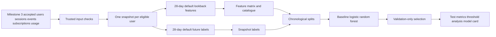

# Churn Prediction Architecture

Milestone 6 implements a local, deterministic, leakage-aware churn prediction workflow over trusted Milestone 3 accepted datasets.

The primary label is `behavioural_churn`: after the snapshot timestamp, the user has no qualifying product activity through the future label-window end. Qualifying activity follows the retention definition and excludes passive or failure-only events such as `session_started`, `feature_error`, `request_failed`, and passive recommendation exposure.

Features are computed only from records at or before the snapshot. Label activity, future subscriptions, future funnel completion, and any post-snapshot records are excluded from features. The runtime also records leakage checks in `run-diagnostics.json`.

Feature groups include account context, activity volume, engagement trajectory, activation context, feature adoption, reliability and friction, subscription context at snapshot, and historical retention-style inactivity. Categorical features are imputed and one-hot encoded; numeric features are imputed and scaled. Preprocessing is fitted on the training split only.

Splits are chronological by snapshot timestamp with train, validation, and test partitions. The validation split selects the model and threshold. The test split is used only for held-out reporting.

The workflow trains a prevalence baseline, class-weighted logistic regression, and random forest comparison when the training labels contain both classes. If a split or training fold has one class, unavailable metrics are emitted as null rather than forced.

Outputs are written to `outputs/models/churn/<model_run_id>/`. Evidence copied to `docs/evidence/milestone-6/` intentionally excludes the full feature matrix, labels, and predictions because those are runtime artifacts.

This is a synthetic-data demonstration. Predictions are probabilistic, feature importance is associative rather than causal, and the model must not be used for automated adverse decisions.
