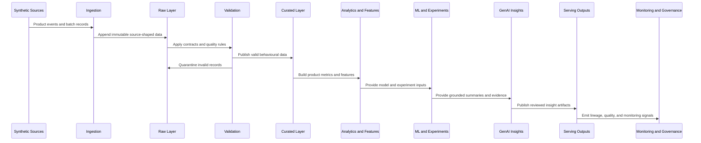

# Data Flow

This document describes the logical data flow. Milestone 3 implements the local raw-to-interim ingestion and validation portion. Milestone 4 implements governed funnel analytics over trusted interim data. Milestone 5 implements governed retention and cohort analytics. ML, GenAI, dashboarding, and Azure deployment remain planned.

## Batch and Streaming Boundaries

Batch processing is suitable for source snapshots, subscriptions, experiment assignments, feedback extracts, historical metric recomputation, and model training datasets.

Streaming processing is suitable for clickstream events, session activity, feature usage, funnel progression, and low-latency monitoring. The same conceptual event contracts should support both paths.

## Validation and Quarantine

Invalid records are separated from accepted interim datasets with source location, failed rule IDs, diagnostics, and ingestion metadata. Milestone 3 implements schema checks, required fields, timestamp constraints, referential integrity, duplicate handling, allowed value rules, quality reports, lineage, and ingestion manifests.

## Serving Outputs

Serving outputs should be stable, documented tables that can be consumed by Power BI, notebooks, or downstream product reviews. The repository should avoid conflicting definitions of the same metric across files.

Milestone 4 writes funnel outputs under `outputs/analytics/funnels/<analysis_run_id>/`, including attempts, summary, stage metrics, segment metrics, time metrics, drop-off diagnostics, lineage, manifest, and diagnostics.

Milestone 5 writes retention outputs under `outputs/analytics/retention/<analysis_run_id>/`, including cohort memberships, user-period activity, retention matrices, long-format metrics, lifecycle status, resurrection analysis, lineage, manifest, and diagnostics.
