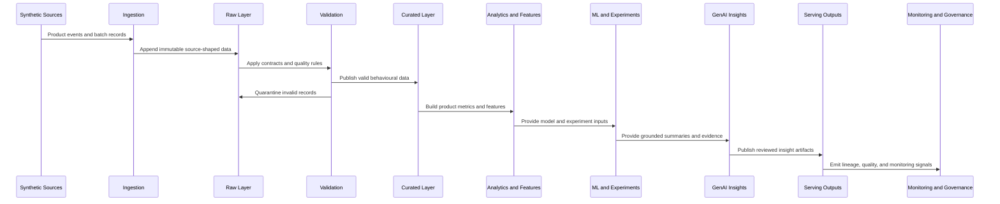

# Data Flow

This document describes the intended logical data flow. It is documentation-only in Milestone 1.

## Batch and Streaming Boundaries

Batch processing is suitable for source snapshots, subscriptions, experiment assignments, feedback extracts, historical metric recomputation, and model training datasets.

Streaming processing is suitable for clickstream events, session activity, feature usage, funnel progression, and low-latency monitoring. The same conceptual event contracts should support both paths.

## Validation and Quarantine

Invalid records should be separated from curated datasets with enough context to diagnose the problem. Future milestones will define schema checks, required fields, timestamp constraints, referential integrity, duplicate handling, and allowed value rules.

## Serving Outputs

Serving outputs should be stable, documented tables that can be consumed by Power BI, notebooks, or downstream product reviews. The repository should avoid conflicting definitions of the same metric across files.

