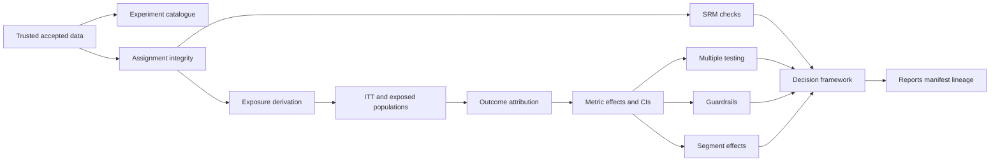

# Governed Experiment Analysis

Milestone 9 implements deterministic fixed-window A/B experiment analysis over trusted Milestone 3 accepted data. The workflow is designed for synthetic NexaFlow portfolio evidence and local validation. It does not provide online experimentation infrastructure, adaptive assignment, bandits, uplift modelling, GenAI conclusions, Power BI files, or Azure resource deployment.

## Catalogue

The experiment catalogue is versioned and reviewable. It covers the four experiments represented in the synthetic sample:

- `exp_simplified_onboarding`
- `exp_template_recommendation`
- `exp_trial_upgrade_prompt`
- `exp_automation_discovery`

Each specification defines the business hypothesis, randomisation unit, eligibility population, variants, control and treatment arms, planned allocation, assignment window, exposure event, primary metric, secondary metrics, guardrails, attribution window, minimum sample size, minimum detectable effect, significance level, target power, segment dimensions, exclusion rules, owner, and decision rule.

## Populations

The primary population is intention-to-treat: every valid assigned user remains in the originally assigned variant. Exposed analysis is reported separately for users with valid experiment exposure. The workflow does not silently replace intention-to-treat with exposed-user results.

## Integrity

Assignment integrity validates known experiment IDs, known variants, unique user-experiment assignment, assignment timestamps inside experiment windows, assignment after signup, exposure after assignment, and conversion after exposure. Invalid assignments are excluded from analytical populations and reported with reason codes. Trusted source data is never modified.

## Exposure And Attribution

Exposure is separate from assignment. For each valid assignment, the workflow derives the first exposure timestamp from source assignment metadata or matching clickstream exposure events. Outcomes are attributed only inside each experiment's configured window. Intention-to-treat metrics use assignment-time attribution; exposed metrics use exposure-time attribution.

## Statistical Methods

Binary outcomes use a two-proportion z-test with a normal-approximation confidence interval for the absolute risk difference. Continuous and count outcomes use transparent difference-in-means analysis with Welch's t-test and confidence intervals. Sample-ratio mismatch uses a chi-square goodness-of-fit test against planned allocation.

Multiple-testing correction supports `none`, `bonferroni`, and `benjamini_hochberg`. The primary metric remains labelled, while secondary, guardrail, and segment tests carry adjusted p-values or exploratory labels.

## Decisions

The deterministic decision framework can return:

- `ship`
- `ship_with_caution`
- `continue_experiment`
- `no_clear_evidence`
- `do_not_ship`
- `invalid_experiment`

Statistical significance alone is insufficient. Decisions consider primary metric direction, adjusted significance, practical significance, sample sufficiency, SRM, integrity, and critical guardrails. Critical integrity or SRM blockers prevent confident winner decisions.

## Outputs

Runtime outputs are written under `outputs/experiments/<analysis_run_id>/`, which is ignored by Git. Concise reproducible evidence is committed under `docs/evidence/milestone-9/`.

## Azure Mapping

The local implementation maps trusted experiment data to ADLS Gen2, metric transformations to Azure Synapse Analytics, scheduled runs to Azure Data Factory or Synapse pipelines, statistical analysis to Azure Machine Learning jobs or governed Python workloads, experiment metadata to MLflow-style tracking or governed experiment tables, monitoring to Azure Monitor and Application Insights, governance and lineage to Microsoft Purview, secrets to Key Vault, identity to managed identity and Azure RBAC, and dashboard consumption to Power BI. No Azure SDKs or clients are installed for this milestone.
