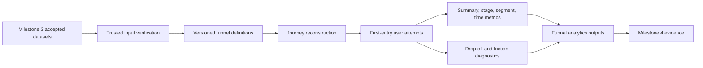

# Governed Funnel Analytics

Milestone 4 implements deterministic, local-first funnel analytics over trusted Milestone 3 accepted datasets. It does not analyse raw source files by default and does not implement retention cohorts, churn modelling, segmentation models, recommendation algorithms, formal A/B-test inference, GenAI, Power BI files, or Azure infrastructure.

## Flow

## Funnel Definitions

Definitions live in `product_growth_intelligence.analytics.funnel_definitions` and include funnel ID, version, business objective, analytical entity, ordered stages, event criteria, alternatives, minimum event counts, completion windows, eligibility rules, conversion outcomes, supported segments, owner, and metric notes.

Implemented funnels:

- `account_activation`
- `onboarding`
- `collaboration_adoption`
- `trial_to_paid`
- `automation_adoption`
- `recommendation_interaction`

## Attempt Semantics

The implemented attempt policy is `first-entry`: one attempt per user per funnel, anchored on the first qualifying entry event. Attempt IDs are deterministic SHA-256 based identifiers.

Events are ordered by event timestamp, session ID, event sequence number, and event ID. Subscription-confirmed paid conversion is supported for the trial-to-paid terminal outcome. The implementation records stage timestamps, stage event IDs, session IDs, sessions involved, repeated qualifying events, error exposure, and stable segment attributes.

## Eligibility and Censoring

Eligibility is defined separately from entry. For example, account activation uses users signed up in the analysis window, onboarding uses users with onboarding entry, collaboration uses team-oriented users, trial-to-paid uses prompt exposure or paid/trial evidence, automation uses automation access or creation, and recommendation uses exposure.

Statuses are mutually exclusive:

- `completed`: final stage reached within the completion window;
- `censored`: completion window extends beyond analysis end;
- `incomplete`: entry occurred but no later stage was reached;
- `abandoned`: a later stage was reached but the final stage was not reached within the observed window.

## Metrics

Outputs include eligible users, entrants, non-entrants, entry rate, stage reach, step conversion, cumulative conversion, drop-off, completion status counts, overall conversion rate, fully observed conversion rate, elapsed time percentiles, sessions involved, repeated-event counts, and error exposure.

Rates are proportions between `0` and `1`. Undefined rates use null/blank output rather than a misleading zero. Percentiles use a deterministic nearest-rank style calculation over sorted integer seconds.

## Segmentation and Suppression

Supported descriptive segment dimensions include persona, acquisition channel, region, preferred device, initial plan, company size band, team-account status, and experiment variant. Experiment variants are descriptive slices only. No p-values, confidence intervals, winners, or causal treatment effects are calculated.

The default suppression threshold is five users. Evidence generation uses an explicit lower threshold because the committed sample is intentionally tiny.

## Azure Mapping

| Local capability | Azure mapping |
| --- | --- |
| Trusted interim files | ADLS Gen2 trusted zone |
| Funnel transformations | Azure Synapse Analytics |
| Scheduled execution | Azure Data Factory or Synapse pipelines |
| Analytical serving | Synapse SQL or governed lake outputs |
| Monitoring | Azure Monitor and Application Insights |
| Governance and lineage | Microsoft Purview |
| Secrets and configuration | Azure Key Vault and App Configuration |
| Dashboard consumption | Power BI |

These mappings are architectural. No Azure SDKs or deployed Azure resources are used.
