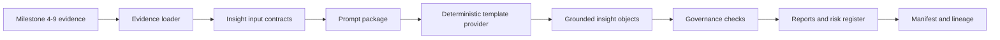

# GenAI Product Insights

Milestone 10 implements a governed, local-first product insight assistant. The default provider is deterministic and template-based: it reads committed evidence from Milestones 4-9, creates structured insight inputs, builds an auditable prompt package, generates grounded insight objects, runs governance checks, and writes Markdown reports plus lineage and manifest artifacts.

The workflow does not call Azure OpenAI, external LLMs, vector databases, live chat services, deployed agents, Power BI, or Azure infrastructure.

## Evidence Inputs

The assistant consumes concise committed evidence under:

- `docs/evidence/milestone-4/`
- `docs/evidence/milestone-5/`
- `docs/evidence/milestone-6/`
- `docs/evidence/milestone-7/`
- `docs/evidence/milestone-8/`
- `docs/evidence/milestone-9/`

Inputs include funnel summaries, retention cohorts, churn metrics and model card, segmentation profiles and card, recommendation comparison and card, experiment decisions and reports, plus lineage references.

## Provider Design

Two providers are defined:

- `deterministic_template`: fully implemented and used by default. It performs no network calls and produces repeatable outputs from parsed evidence.
- `azure_openai_placeholder`: configuration-only placeholder for future Azure AI Foundry or Azure OpenAI mapping. It records endpoint and deployment environment-variable names, managed identity and Key Vault expectations, and returns prompt metadata without making a live call.

## Grounding Rules

Every insight must cite at least one local evidence artifact. Numeric claims are generated from parsed metrics, not free text. Reports include the synthetic-data disclaimer. Guardrails block unsupported causal language, churn certainty claims, recommendation probability claims, missing segment interpretation caveats, and missing experiment sample-size or guardrail caveats.

## Outputs

Runtime outputs are written to `outputs/genai/product-insights/<run_id>/` and are ignored by Git. Concise reproducible evidence is committed under `docs/evidence/milestone-10/`.

## Azure Mapping

The local design maps evidence artifacts to ADLS Gen2 curated analytics zones, prompt packages to Azure AI Foundry prompt-flow artifacts, the provider interface to a future Azure OpenAI deployment adapter, governance checks to Azure AI Content Safety and Responsible AI controls, lineage to Microsoft Purview, secrets to Key Vault, identity to managed identity and Azure RBAC, observability to Azure Monitor and Application Insights, and reporting consumption to Power BI or Synapse serving outputs. No Azure deployment is claimed by this milestone.
