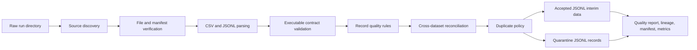
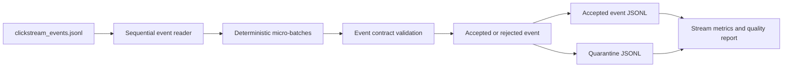

# Ingestion and Quality Architecture

Milestone 3 implements a local ingestion and data-quality layer for the seven NexaFlow source datasets. The implementation is local-first and uses only the Python standard library. It does not deploy Event Hubs, ADLS Gen2, Azure Functions, Stream Analytics, Purview, Azure Monitor, or any other Azure resource.

## Batch Flow

The batch command reads a raw generation directory such as `data/samples/nexaflow` or `data/raw/<generation_run_id>`, validates the optional source `manifest.json`, parses all seven required datasets, applies schema, domain, temporal, duplicate, and cross-dataset rules, and writes run-scoped artefacts under `data/interim/<ingestion_run_id>` and `outputs/quality/<ingestion_run_id>`.

Accepted and quarantined records are written as canonical JSONL so nested ingestion metadata can be preserved without mutating business fields. The committed raw sample fixture is not modified.

## Streaming Simulation

The streaming command simulates Event Hubs-style event processing by reading `clickstream_events.jsonl` sequentially in configurable micro-batches. It validates events independently and writes deterministic accepted, quarantine, quality, and metrics outputs when a fixed ingestion timestamp is supplied. Automated tests do not use real sleeps.

## Contracts and Rules

Executable contracts live in `product_growth_intelligence.validation.contracts`. Each contract defines dataset name, version, filename, format, grain, fields, types, primary key, foreign keys, timestamps, known categorical values, nullable fields, sensitivity, and schema-evolution posture.

Quality rules cover:

- file integrity: required files, manifest JSON, row counts, checksums, source contract version;
- schema and completeness: required fields, duplicate headers, unknown fields, type conversion, JSON object properties;
- domain validity: catalogues, event taxonomy, experiment variants, ratings, non-negative counts and revenue;
- temporal integrity: session windows, event timestamps, subscriptions, experiments, feedback after signup;
- referential integrity: user and session foreign keys;
- consistency: session event counts, feature usage reconciliation, conversion flag/timestamp agreement;
- uniqueness: duplicate primary-key handling.

## Schema Drift and Duplicates

Schema drift policies are:

- `strict`: reject missing required fields and unexpected fields;
- `compatible`: reject incompatible unknown fields while allowing governed compatible evolution to be introduced explicitly;
- `report-only`: report drift while retaining otherwise valid records.

Duplicate policies are:

- `reject`: conservative default; duplicate primary keys are quarantined and reported;
- `keep-first`: retain the first accepted record and report duplicates as warnings;
- `keep-last`: retain the last accepted record and report duplicates as warnings.

## Failure Semantics

Pipeline-fatal failures include missing source directories, unsupported settings, invalid manifest structure, incompatible source contract versions, and existing non-empty output directories without `--overwrite`. Record-level failures produce quarantine records unless thresholds fail the whole run. The CLI returns non-zero when the run status is `failed`.

Quality status logic:

- `passed`: no errors, critical failures, or warnings;
- `passed_with_warnings`: warning-only findings;
- `failed`: at least one error, critical finding, or threshold breach.

## Azure Mapping

| Local capability | Azure mapping |
| --- | --- |
| Raw input directory | ADLS Gen2 raw container |
| Sequential JSONL event reader | Azure Event Hubs consumer |
| Micro-batch processor | Azure Functions or Azure Stream Analytics |
| Executable contracts | Governed schema contracts or Event Hubs schema support |
| Interim accepted data | ADLS Gen2 trusted or curated zone |
| Quarantine data | ADLS Gen2 quarantine zone |
| Quality reports | ADLS artefacts, Log Analytics, or monitoring dashboard inputs |
| Secrets/configuration | Azure Key Vault and App Configuration |
| Runtime identity | Managed Identity and Azure RBAC |
| Metrics/logging | Azure Monitor and Application Insights |
| Governance/lineage | Microsoft Purview |

These mappings are architectural only in Milestone 3. No Azure SDK clients or fake Azure clients are implemented.
