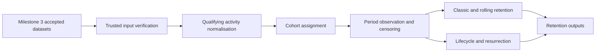

# Retention and Cohort Analytics

Milestone 5 implements deterministic retention and cohort analytics over trusted Milestone 3 accepted datasets. It is descriptive only: no churn prediction, ML segmentation, recommendation modelling, formal experiment inference, GenAI, Power BI files, or Azure infrastructure are implemented.

## Flow

## Definitions

Implemented definitions:

- `signup_retention`: anchor is signup timestamp.
- `activation_retention`: anchor is first `task_completed` or `workspace_created`.
- `paid_user_retention`: anchor is first paid subscription start.
- `collaboration_user_retention`: anchor is first collaboration action.
- `automation_user_retention`: anchor is first `automation_executed`.
- `recommendation_engaged_retention`: anchor is first recommendation click or acceptance.

Each user has at most one membership per retention definition. Membership IDs are deterministic SHA-256 based identifiers.

## Time Grains

Supported grains are `daily`, `weekly`, and `monthly`. Weekly periods use Monday-start ISO weeks. Monthly periods use calendar month starts, not fixed 30-day windows. Period 0 is the anchor period.

## Activity

Default qualifying activity includes meaningful product-use events and excludes isolated `session_started`, `feature_error`, `request_failed`, and passive `recommendation_shown` exposure. The activity model supports minimum event counts and minimum active days.

## Censoring

A user-period is observed only when the full period has elapsed by the analysis end timestamp. Censored cells are not treated as zero retention. Long-format output includes cohort size, observed denominator, censored users, retained users, classic retention, rolling retention, and suppression status.

## Lifecycle

Lifecycle statuses are descriptive:

- `new`
- `active`
- `inactive`
- `churned_descriptive`
- `resurrected`
- `censored`

Behavioural inactivity remains separate from subscription cancellation. These statuses are not future churn labels for modelling.

## Azure Mapping

| Local capability | Azure mapping |
| --- | --- |
| Trusted accepted datasets | ADLS Gen2 trusted zone |
| Cohort transformations | Azure Synapse Analytics |
| Scheduled retention pipeline | Azure Data Factory or Synapse pipelines |
| Analytical serving | Synapse SQL or governed lake outputs |
| Monitoring | Azure Monitor and Application Insights |
| Governance and lineage | Microsoft Purview |
| Configuration and secrets | Azure App Configuration and Key Vault |
| Dashboard consumption | Power BI |

The mapping is architectural only. No Azure SDKs, clients, credentials, or resources are used.
