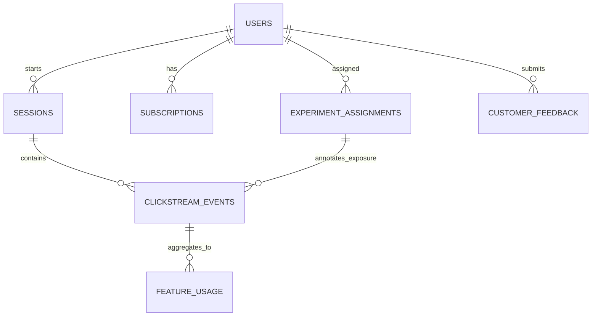

# Synthetic Data Model

Milestone 2 introduces deterministic synthetic data for a fictional subscription product named NexaFlow. NexaFlow is a collaborative productivity platform for individual professionals and small business teams.

The generated data is entirely synthetic. It contains no names, emails, phone numbers, street addresses, real reviews, production telemetry, or customer information. Designed correlations are intentional modelling assumptions, not evidence about a real population.

## Lineage

## Profiles

| Profile | Default users | Intended use | Default output |
| --- | ---: | --- | --- |
| `sample` | 12 | Committed fixture and fast tests | `data/samples/nexaflow` |
| `development` | 250 | Local demonstration | `data/raw/development-run` |

Both profiles use a fixed default simulation period from `2025-01-01` to `2025-03-31`, UTC timestamps, and deterministic seed `42`.

## Personas

The generator uses documented personas: `solo_professional`, `small_team_member`, `team_admin`, `operations_lead`, `casual_explorer`, and `power_user`.

Personas influence acquisition channel, company size, preferred features, session frequency, collaboration intensity, upgrade propensity, churn propensity, and feedback likelihood.

## Behavioural Relationships

The generator deliberately models relationships between:

- acquisition channel and persona;
- persona and preferred features;
- company size and collaboration activity;
- plan and available product features;
- onboarding quality and later engagement;
- engagement and session frequency;
- engagement and paid conversion;
- product errors and negative feedback;
- feature success and positive feedback;
- inactivity and cancellation probability;
- experiment variant and simulated conversion probability.

Outcomes include controlled stochastic variation, so relationships are explainable without becoming perfectly predictable.

## Event Taxonomy

Event names are centralised in `product_growth_intelligence.data_generation.catalogues.EVENT_TAXONOMY`. Each event maps to a journey stage, optional feature, expected properties, and event type such as exposure, action, success, failure, or outcome.

Representative event groups include acquisition and onboarding, core engagement, collaboration, advanced features, monetisation and retention, recommendation interaction, and reliability.

## Limitations

The generated data is suitable for later analytics and ML milestones, but no ingestion, funnel logic, retention analysis, model training, statistical experiment analysis, GenAI calls, dashboards, or Azure infrastructure are implemented in Milestone 2. Synthetic sentiment labels are ground-truth labels assigned by templates, not model predictions.

