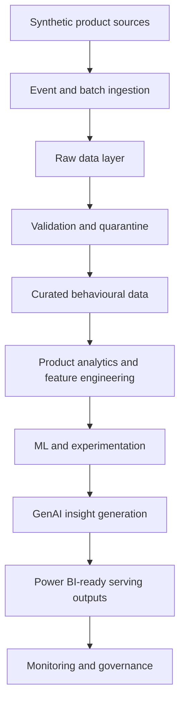

# System Overview

The Azure Product Growth Intelligence Platform is a local-first reference architecture for understanding product behaviour across acquisition, activation, engagement, retention, monetisation, experimentation, recommendation, and feedback loops.

Milestone 1 provides the foundation only: repository structure, configuration conventions, architecture documentation, governance notes, CI, and lightweight package helpers. It does not implement data generation, ingestion, analytics, machine learning, GenAI calls, dashboards, or infrastructure deployment.

## Logical Workload Flow

## Local Reference Implementation

The local implementation is the default path for development and validation. It will use deterministic synthetic data, local files, Python modules, and test fixtures so reviewers can run the project without Azure credentials.

## Optional Azure-Native Implementation

The Azure-native implementation is a planned deployment path. It maps local interfaces to Azure Event Hubs, Data Lake Storage Gen2, Stream Analytics or Functions, Synapse Analytics, Azure Machine Learning, Azure AI Foundry, Azure OpenAI, Power BI, Azure Monitor, Application Insights, Microsoft Purview, Key Vault, Microsoft Entra ID, and Azure RBAC.

## Workload Types

Batch processing covers scheduled synthetic source generation, historical snapshots, metric tables, model training inputs, and Power BI-ready outputs.

Streaming processing covers product events that would arrive continuously through an event stream. In the local implementation, this will be represented without requiring Event Hubs.

Analytical workloads compute descriptive and diagnostic metrics such as active users, funnels, conversion, retention, churn, and feature adoption.

Predictive workloads train and evaluate models for churn, segmentation, and recommendations using reproducible features.

Generative AI workloads create grounded summaries and product recommendations from validated analytical outputs and feedback themes. Generated recommendations require human review.

