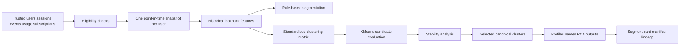

# User Segmentation Architecture

Milestone 7 implements governed user segmentation over trusted Milestone 3 accepted outputs.

The default analytical grain is one eligible user at one segmentation snapshot timestamp. Features use only records at or before the snapshot. Future subscription changes, future funnel outcomes, future retention states, churn labels, model predictions, and later events are excluded.

Rule-based segmentation is mutually exclusive and precedence-driven. It covers inactive users, high-friction users, paid under-engaged users, automation power users, collaboration adopters, declining engagement, core engaged users, new explorers, and casual users.

KMeans is the principal unsupervised method. Numeric and binary clustering features are standardised, constant features are removed, candidate cluster counts are evaluated, and cluster IDs are canonicalised using deterministic engagement, advanced-feature adoption, inactivity, and fingerprint ordering.

PCA outputs are produced for analytical visualisation support only. PCA is not used as a substitute for cluster-quality evaluation.

Segment names are deterministic profile interpretations, not GenAI output and not causal claims. The workflow is designed for product analysis and prioritisation, not automated adverse decisions.
